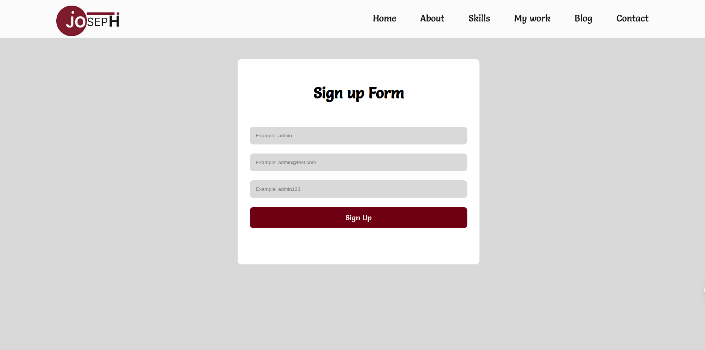
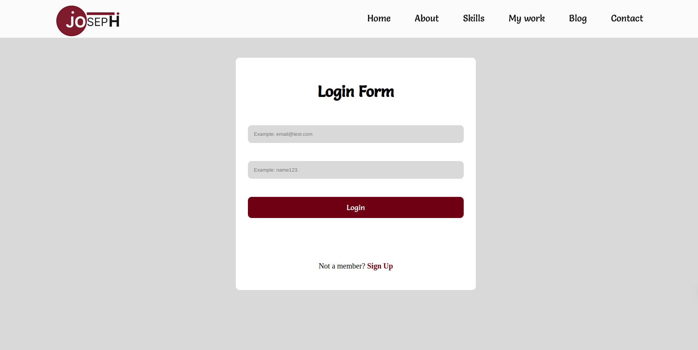
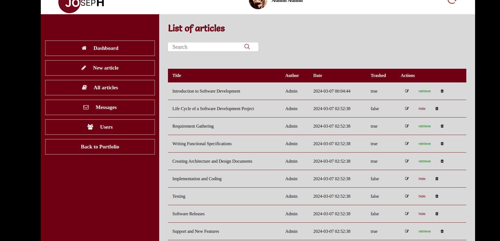
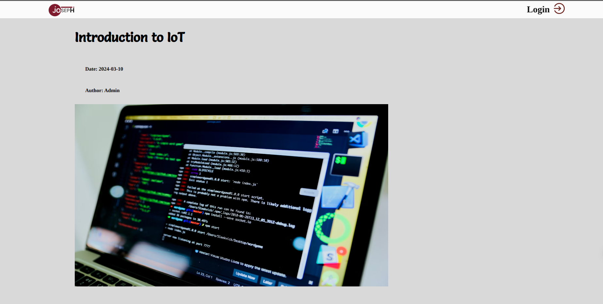
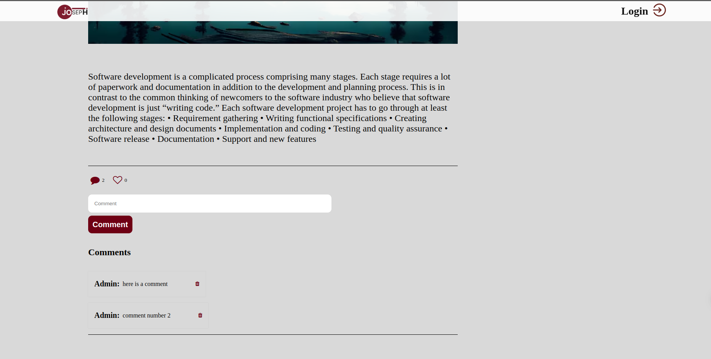

# my-brand

## 🚀 - [Backend repository](https://github.com/Irirwanirira/my-brand-back-end)

<!-- PROJECT DESCRIPTION -->

# 📖 My Portfolio 

My portfolio is a collection of my works and projects that highlights my skills and expertise. It provides tangible evidence of my abilities and serves as a visual representation of my creative journey. Additionally, my portfolio includes my contact information, making it easy for potential clients or collaborators to connect with me. By sharing my portfolio.

## 🛠 Built With 

### Tech Stack 

  
Client

  <ul>
    <li>TypeScript</li>
  </ul>

  
Server

  <ul>
    <li><a href="https://expressjs.com/">Express.js</a></li>
  </ul>

Styles

  <ul>
    <li><a href="https://tailwindcss.com/">CSS</a></li>
  </ul>

<!-- Features -->

### Key Features 

- **Skills**
- **Project**
- **Contact**

(<a href="#readme-top">back to top</a>)

<!-- LIVE DEMO -->

## 🚀 Live Demo 

- [Live Demo Link](https://irirwanirira.github.io/my-brand/src/)

(<a href="#readme-top">back to top</a>)

<!-- GETTING STARTED -->

<!-- AUTHORS -->

## 👥 Author 

👤 **Author1**

- GitHub: [@githubhandle](https://github.com/githubhandle)
- Twitter: [@twitterhandle](https://twitter.com/twitterhandle)
- LinkedIn: [LinkedIn](https://linkedin.com/in/linkedinhandle)

(<a href="#readme-top">back to top</a>)

<!-- FUTURE FEATURES -->

## 🔭 Future Features 

- [ ] **About me**
- [ ] **Job experience**
- [ ] **testimonials**

(<a href="#readme-top">back to top</a>)

<!-- CONTRIBUTING -->

## 🤝 Contributing 

Contributions, issues, and feature requests are welcome!

Feel free to check the [issues page](https://github.com/Irirwanirira/Portfolio-v1/issues).

(<a href="#readme-top">back to top</a>)

<!-- SUPPORT -->

## ⭐️ Show your support 

If you find my portfolio impressive, I would greatly appreciate it if you could leave a star. If you have any suggestions or feedback, please feel free to create an issue in the designated pages. Your input is highly valued and will help me improve my portfolio.

(<a href="#readme-top">back to top</a>)

<!-- ACKNOWLEDGEMENTS -->

## 🙏 Acknowledgments 

I would like to express my gratitude to everyone who shared their various designs with me. Your contributions have given me valuable ideas and inspiration for what I can do. Thank you all!

(<a href="#readme-top">back to top</a>)

<!-- LICENSE -->

## 📝 License 

This project is [MIT](./LICENSE) licensed.

(<a href="#readme-top">back to top</a>)

